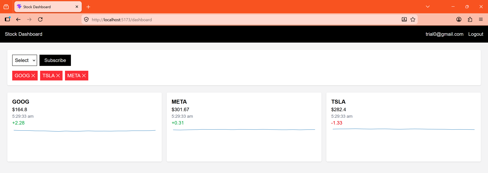

# Stock Broker Client Dashboard

## Overview

This project is a real-time stock broker client dashboard built using React, Node.js, Express, MongoDB, and Socket.IO.

Users can log in using their email address and a simulated OTP flow, subscribe to supported stocks, and receive live stock price updates without refreshing the page.

Stock prices are simulated using a random price generator and are updated automatically every 2 seconds.

---

## Features

### Authentication

- Login using email
- OTP verification flow
- JWT-based authentication
- User session persists after page refresh

### Stock Subscriptions

Supported stocks:

- GOOG
- TSLA
- AMZN
- META
- NVDA

Users can:

- Subscribe to stocks
- Unsubscribe from stocks
- View only their subscribed stocks

### Real-Time Updates

- Stock prices update automatically
- No page refresh required
- Powered by Socket.IO

### Multi-User Support

Multiple users can be logged in at the same time.

Example:

User A:

- GOOG
- TSLA

User B:

- META
- NVDA

Both users receive independent stock updates based on their own subscriptions.

### Dashboard

Each stock card displays:

- Ticker symbol
- Current price
- Price change
- Last updated time
- Price history chart

---

## Tech Stack

### Frontend

- React
- React Router
- Axios
- Socket.IO Client
- Tailwind CSS
- Recharts

### Backend

- Node.js
- Express
- Socket.IO
- MongoDB
- Mongoose
- JWT Authentication

---

## Project Structure

### Backend

```text
backend
├── config
├── controllers
├── middleware
├── models
├── routes
├── services
├── utils
├── .env
└── server.js
```

### Frontend

```text
frontend
├── src
│   ├── api
│   ├── components
│   ├── context
│   ├── hooks
│   ├── pages
│   └── services
└── package.json
```

---

## Setup Instructions

### Prerequisites

Install:

- Node.js
- MongoDB
- Git (optional)

---

## Clone Project

```bash
git clone https://github.com/maithilikh/ES-CUPI-Assgn.git

cd stock-dashboard
```

Or simply download and extract the ZIP.

---

## Backend Setup

Open a terminal:

```bash
cd backend
```

Install dependencies:

```bash
npm install
```

Create a `.env` file:

```env
PORT=5000

MONGO_URI=mongodb://127.0.0.1:27017/stock-dashboard

JWT_SECRET=mysecretkey
```

Start backend:

```bash
npm run dev
```

Expected output:

```text
MongoDB connected

Server running on 5000
```

---

## Frontend Setup

Open another terminal:

```bash
cd frontend
```

Install dependencies:

```bash
npm install
```

Start frontend:

```bash
npm run dev
```

Vite will provide a local URL similar to:

```text
http://localhost:5173
```

Open it in your browser.

---

## How OTP Works

To keep the project simple, OTPs are not sent through email.

When requesting an OTP, the backend prints it in the terminal.

Example:

```text
OTP for trial0@gmail.com: 482391
```

Use this OTP on the verification screen.

---

## How Stock Prices Work

Real market data is not used.

Prices are generated using a random walk algorithm.

Every 2 seconds:

- A random value is generated
- The stock price is updated
- Connected users receive updates through Socket.IO

This allows the application to demonstrate real-time functionality without requiring third-party APIs.

---

## Testing Multiple Users

Open two browser windows.

Window 1:

```text
user1@gmail.com
```

Subscribe to:

```text
GOOG
TSLA
```

Window 2:

```text
user2@gmail.com
```

Subscribe to:

```text
META
NVDA
```

Both dashboards will receive different stock updates at the same time.

---



## Assumptions

- OTP delivery is simulated through console logs.
- Stock prices are generated locally.
- Supported stocks are fixed.
- MongoDB is running locally.

---

## Future Improvements

Possible enhancements include:

- Email delivery for OTPs
- Redis caching
- User profile management
- Real market data integration
- Docker support
- Unit and integration tests
- Deployment to cloud infrastructure

---

## Notes

This project was created as a demonstration of:

- React frontend development
- REST API design
- JWT authentication
- MongoDB integration
- Real-time communication using Socket.IO
- Multi-user event handling
